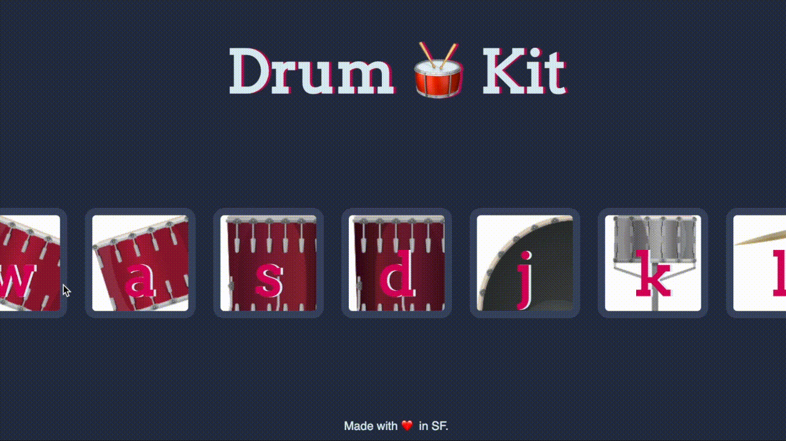

# Drum Kit: DOM Manipulation using Javascript
### Coding challenge from the Udemy Course [the Complete 2020 Web Developer Bootcamp](https://www.udemy.com/course/the-complete-web-development-bootcamp/)
I wrote the code in index.js. The other files were provided by the instructor.

## 💡Lessons Learned
- query selectors
- event.key
- this keyword
- switch and case
- creating audio in javascript

## 🚀 Getting Started
- [Live on Code Sandbox](https://codesandbox.io/s/adoring-dubinsky-4fdo8)
⚠️ For best performance, download repo and run locally. The sound lags in code sandbox.

To run this project locally:
- Option 1: With the folder open in your text editor, right click on the index.html and select "Copy Path", and then paste into the browser of your choice
- Option 2: With the folder open in your text editor, right click on the index.html and select "Open with Live Server"

## 🕹 How to Use
Play the drum-set using the corresponding keys on your keyboard or by clicking the images.

## 📣 Reference
- Section 13: Advanced Javascript and DOM Manipulation of the Udemy Course [the Complete 2020 Web Developer Bootcamp](https://www.udemy.com/course/the-complete-web-development-bootcamp/)